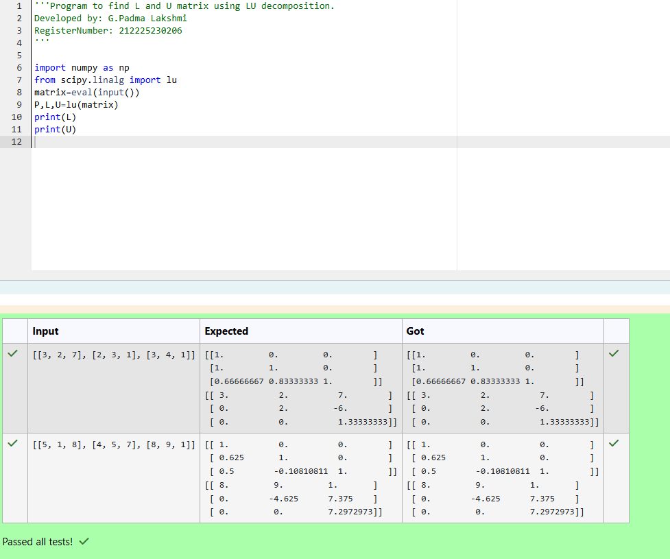
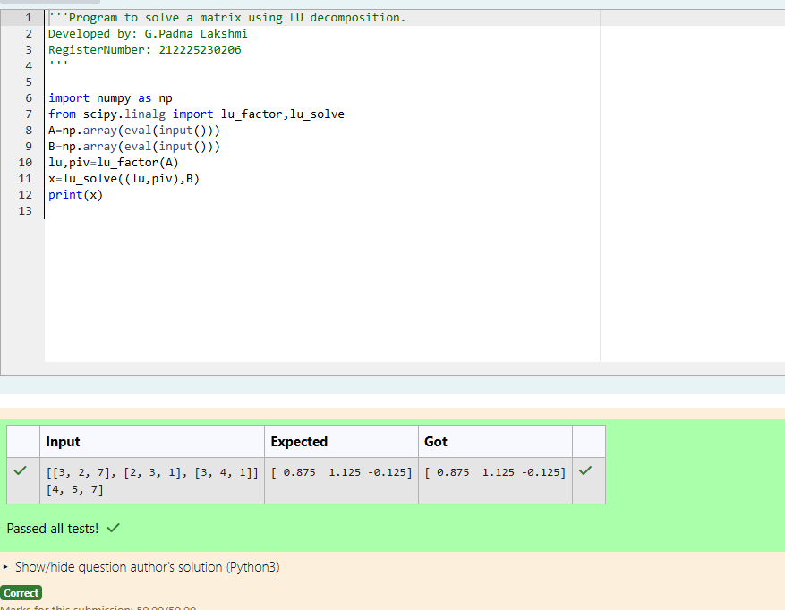

# LU Decomposition 

## AIM:
To write a program to find the LU Decomposition of a matrix.

## Equipments Required:
1. Hardware – PCs
2. Anaconda – Python 3.7 Installation / Moodle-Code Runner

## Algorithm
1. Import the numpy module to use the built-in functions for calculation
2. Prepare the lists from each linear equations and assign in np.array()
3. Using the np.linalg.eig(), we get two results (first is eigenvalue and second is eigenvector) of the given matrix.
4. End the program

## Program:
~~~
(i) To find the L and U matrix

'''Program to find L and U matrix using LU decomposition.
Developed by: G.Padma Lakshmi
RegisterNumber: 212225230206
'''

import numpy as np
from scipy.linalg import lu
matrix=eval(input())
P,L,U=lu(matrix)
print(L)
print(U)

(ii) To find the LU Decomposition of a matrix

'''Program to solve a matrix using LU decomposition.
Developed by: G.Padma Lakshmi
RegisterNumber: 212225230206
'''

import numpy as np
from scipy.linalg import lu_factor,lu_solve
A=np.array(eval(input()))
B=np.array(eval(input()))
lu,piv=lu_factor(A)
x=lu_solve((lu,piv),B)
print(x)

~~~
## Output:
(i) To find the L and U matrix

(ii) To find the LU Decomposition of a matrix

## Result:
Thus the program to find the LU Decomposition of a matrix is written and verified using python programming.

