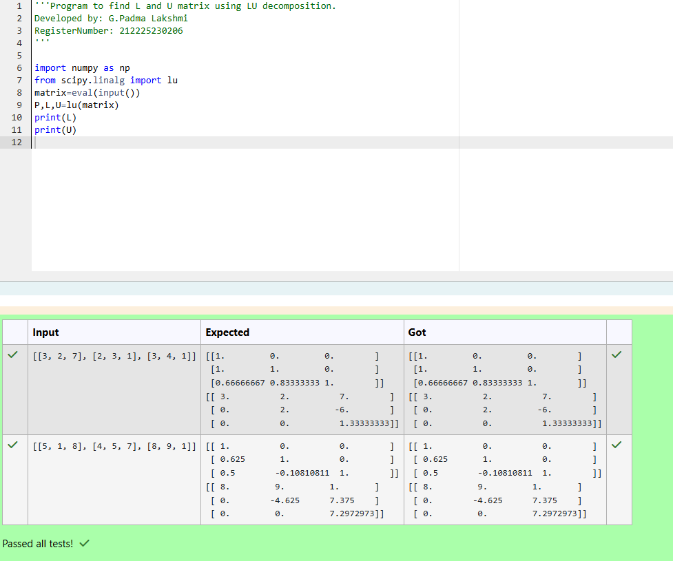
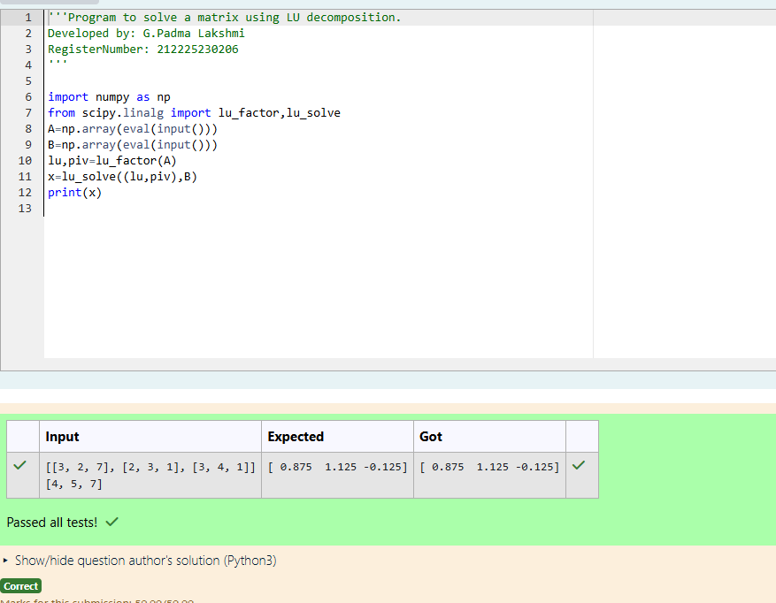

# LU Decomposition 

## AIM:
To write a program to find the LU Decomposition of a matrix.

## Equipments Required:
1. Hardware – PCs
2. Anaconda – Python 3.7 Installation / Moodle-Code Runner

## Algorithm
1. Import the NumPy module to perform matrix operations.
2. Create the matrix by entering the elements in a list and convert it into a NumPy array using np.array().
3. Initialize two matrices L (lower triangular matrix) and U (upper triangular    matrix) and perform LU Decomposition using NumPy functions.
4. Display the matrices L and U using the print() function. End of Program. 

## Program:
~~~
(i) To find the L and U matrix

'''Program to find L and U matrix using LU decomposition.
Developed by: G.Padma Lakshmi
RegisterNumber: 212225230206
'''

import numpy as np
from scipy.linalg import lu
matrix=eval(input())
P,L,U=lu(matrix)
print(L)
print(U)

(ii) To find the LU Decomposition of a matrix

'''Program to solve a matrix using LU decomposition.
Developed by: G.Padma Lakshmi
RegisterNumber: 212225230206
'''

import numpy as np
from scipy.linalg import lu_factor,lu_solve
A=np.array(eval(input()))
B=np.array(eval(input()))
lu,piv=lu_factor(A)
x=lu_solve((lu,piv),B)
print(x)

~~~
## Output:
(i) To find the L and U matrix

(ii) To find the LU Decomposition of a matrix

## Result:
Thus the program to find the LU Decomposition of a matrix is written and verified using python programming.

